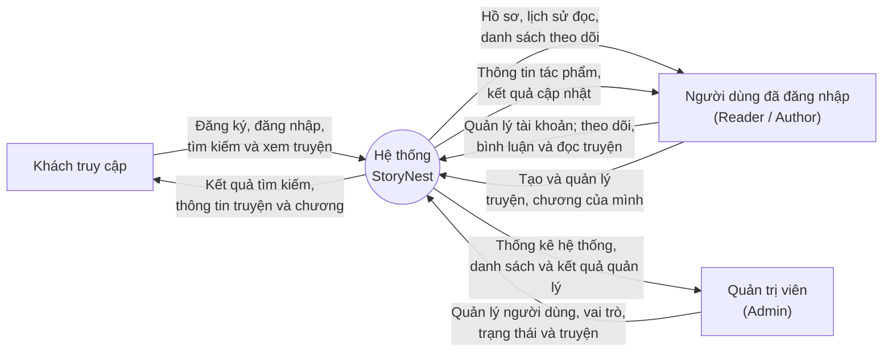

# Context Diagram - StoryNest

## Phạm vi

- **Khách truy cập:** đăng ký, đăng nhập, tìm kiếm, xem truyện và đọc chương công khai.
- **Người dùng đã đăng nhập:** quản lý tài khoản, bình luận, theo dõi truyện, xem lịch sử đọc và quản lý tác phẩm thuộc quyền sở hữu.
- **Quản trị viên:** quản lý tài khoản, phân vai trò, thay đổi trạng thái người dùng và quản lý truyện toàn hệ thống.
- **StoryNest:** xử lý xác thực, phân quyền và toàn bộ nghiệp vụ của ứng dụng.

> `Moderator` đã được khai báo trong `UserRole`, nhưng hiện chưa có luồng nghiệp vụ hoặc controller được phân quyền riêng, nên chưa được biểu diễn thành một tác nhân độc lập.

