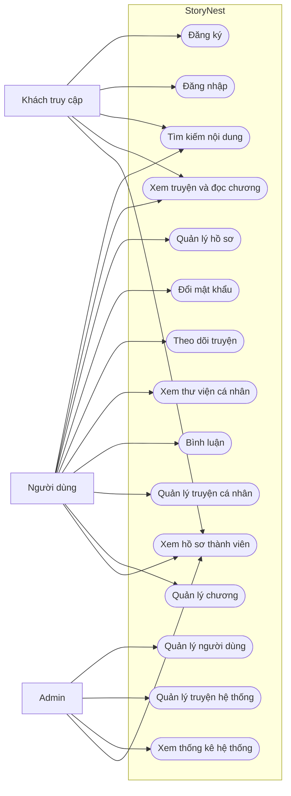

# Use Cases

## 1. Sơ đồ Use Case tổng quát

## 2. Danh sách Use Case

| ID | Use Case | Tác nhân | Điều kiện chính |
|---|---|---|---|
| UC-01 | Đăng ký tài khoản | Khách | Username và email chưa tồn tại |
| UC-02 | Đăng nhập | Khách | Thông tin đúng, tài khoản `Active` |
| UC-03 | Tìm kiếm nội dung | Khách, Người dùng | Không |
| UC-04 | Xem truyện và đọc chương | Khách, Người dùng | Truyện còn hoạt động |
| UC-05 | Quản lý hồ sơ | Người dùng | Đã đăng nhập |
| UC-06 | Đổi mật khẩu | Người dùng | Đã đăng nhập, mật khẩu hiện tại đúng |
| UC-07 | Theo dõi/bỏ theo dõi truyện | Người dùng | Đã đăng nhập |
| UC-08 | Xem thư viện cá nhân | Người dùng | Đã đăng nhập |
| UC-09 | Bình luận truyện/chương | Người dùng | Đã đăng nhập |
| UC-10 | Tạo và quản lý truyện | Người dùng | Đã đăng nhập |
| UC-11 | Tạo và quản lý chương | Chủ sở hữu truyện | Đã đăng nhập và sở hữu truyện |
| UC-12 | Quản lý người dùng | Admin | Role `Admin` |
| UC-13 | Quản lý truyện hệ thống | Admin | Role `Admin` |
| UC-14 | Xem thống kê hệ thống | Admin | Role `Admin` |
| UC-15 | Xem hồ sơ công khai | Khách, Người dùng, Admin | Thành viên tồn tại |

## 3. Use Case chi tiết

### UC-02 — Đăng nhập

**Tiền điều kiện:** người dùng chưa đăng nhập.

**Luồng chính:**

1. Người dùng nhập username/email và mật khẩu.
2. Hệ thống tìm tài khoản.
3. Hệ thống xác minh mật khẩu bằng BCrypt.
4. Hệ thống kiểm tra trạng thái tài khoản là `Active`.
5. Hệ thống tạo claims gồm ID, tên, email và role.
6. Hệ thống tạo authentication cookie và chuyển về trang phù hợp.

**Ngoại lệ:**

- Sai tài khoản hoặc mật khẩu: hiển thị lỗi.
- Tài khoản không `Active`: từ chối đăng nhập.

### UC-10 — Quản lý truyện cá nhân

**Tiền điều kiện:** người dùng đã đăng nhập.

**Luồng chính:**

1. Người dùng mở Dashboard.
2. Hệ thống lấy danh sách truyện có `AuthorId` bằng ID của người dùng.
3. Người dùng tạo mới hoặc chọn một truyện để xem/sửa.
4. Hệ thống kiểm tra quyền sở hữu trước khi truy xuất dữ liệu.
5. Hệ thống kiểm tra dữ liệu và lưu thay đổi.

**Ngoại lệ:** truyện không tồn tại hoặc không thuộc người dùng thì thao tác không được thực hiện.

### UC-12 — Quản lý người dùng

**Tiền điều kiện:** người dùng đã đăng nhập với role `Admin`.

**Luồng chính:**

1. Admin mở khu vực System.
2. Hệ thống kiểm tra role trong claim.
3. Admin chọn tài khoản.
4. Admin cập nhật thông tin, role, trạng thái hoặc đặt lại mật khẩu.
5. Hệ thống kiểm tra Admin không tự hạ quyền/vô hiệu hóa chính mình.
6. Hệ thống lưu thay đổi và trả kết quả.
