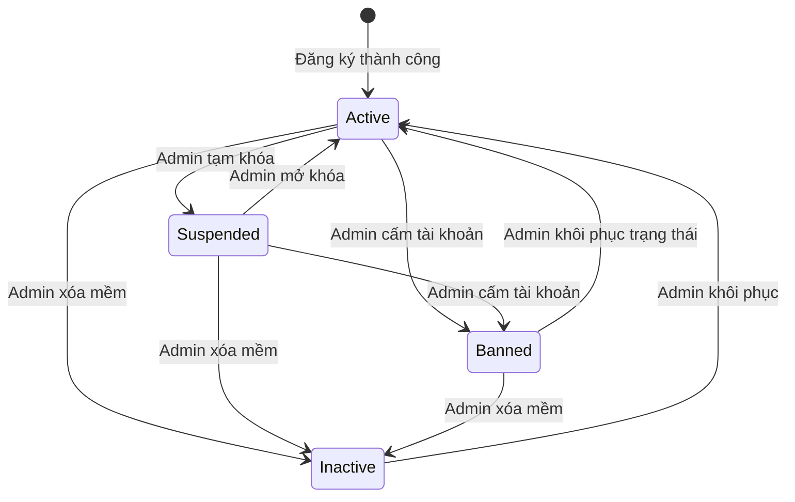
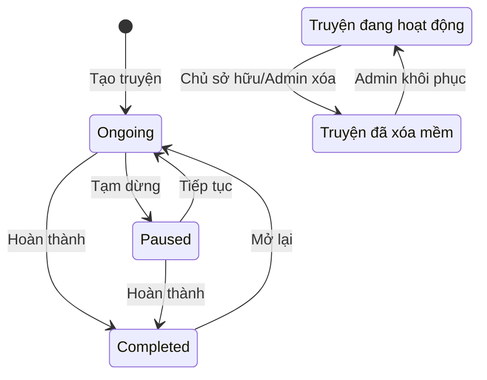
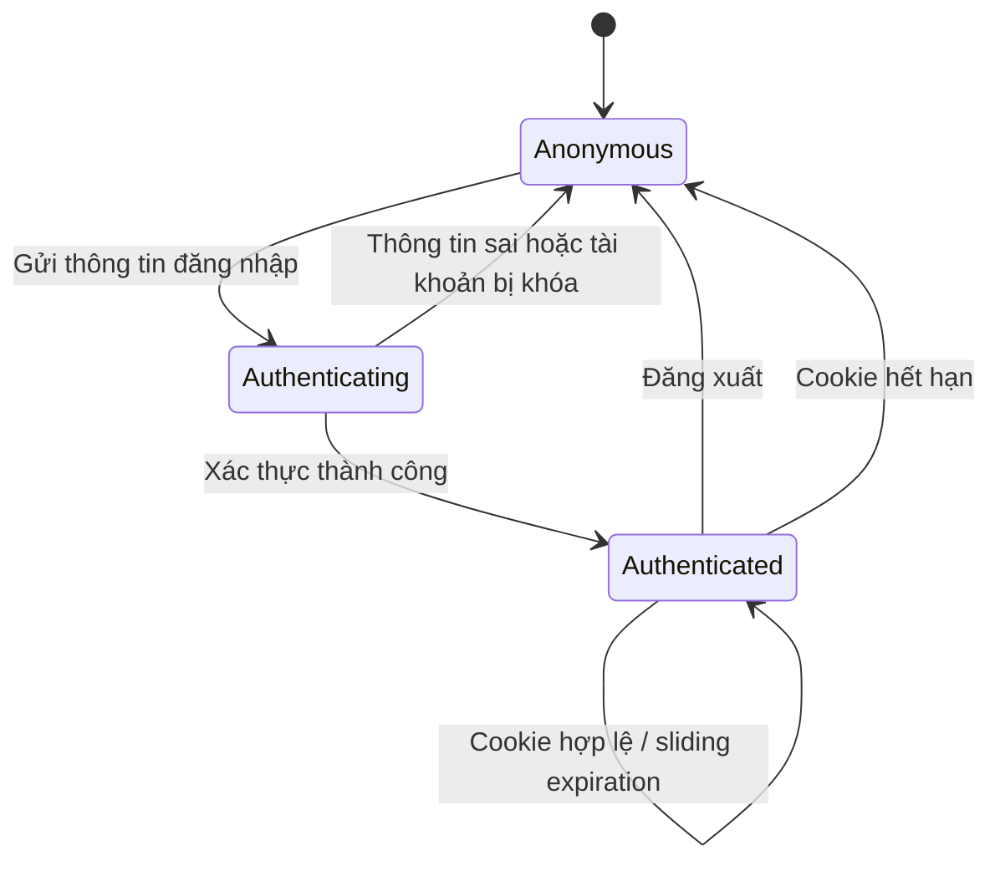
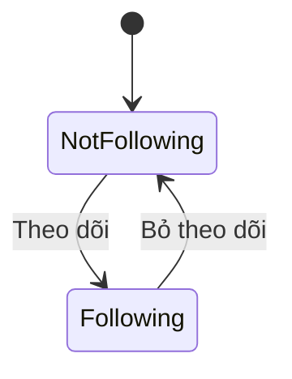

# State Diagrams

## 1. Trạng thái tài khoản

Chỉ tài khoản ở trạng thái `Active` được đăng nhập.

## 2. Trạng thái truyện

Trạng thái nghiệp vụ và trạng thái xóa mềm là hai thuộc tính độc lập: `Status` và `IsActive`.

## 3. Trạng thái phiên đăng nhập

## 4. Trạng thái theo dõi truyện

