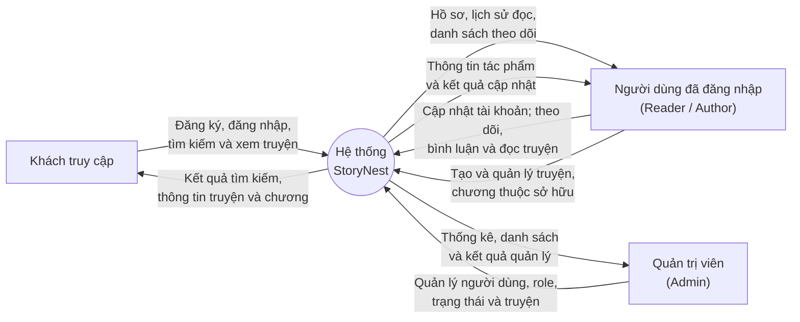

# Context Diagram

## Ranh giới hệ thống

- Sơ đồ chỉ biểu diễn tác nhân bên ngoài và toàn bộ StoryNest như một tiến trình duy nhất.
- SQL Server là thành phần dữ liệu nội bộ của StoryNest nên không biểu diễn như tác nhân bên ngoài.
- `Moderator` chưa có nghiệp vụ riêng nên chưa được tách thành tác nhân.

