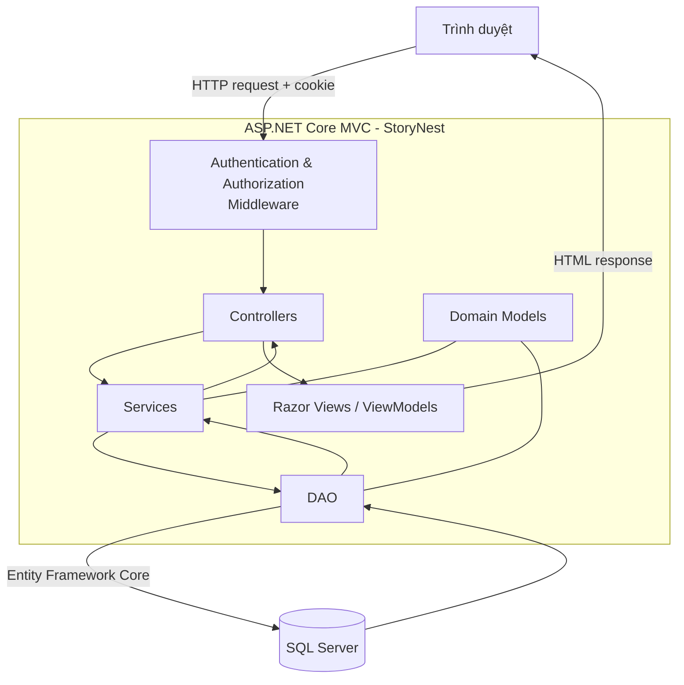
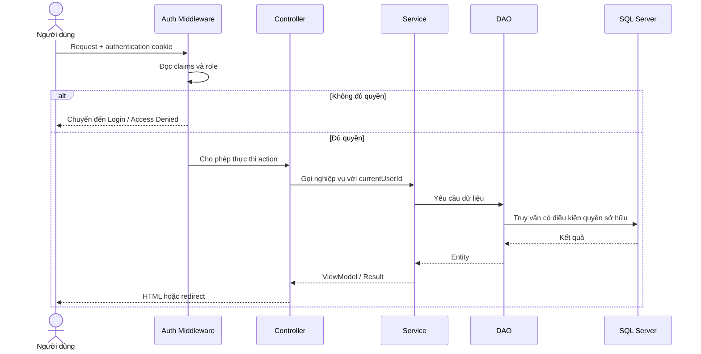

# Architecture

## 1. Kiến trúc tổng thể

## 2. Trách nhiệm các tầng

| Tầng | Trách nhiệm | Ví dụ |
|---|---|---|
| Controller | Nhận request, kiểm tra model, điều hướng response | `AccountController`, `DashboardController` |
| Service | Nghiệp vụ, kiểm tra quyền sở hữu, ánh xạ ViewModel | `UserService`, `DashboardService` |
| DAO | Truy vấn và lưu dữ liệu | `UserDao`, `NovelDao`, `SystemDao` |
| Model | Thực thể và enum nghiệp vụ | `User`, `Novel`, `Chapter` |
| ViewModel | Dữ liệu đầu vào/đầu ra của giao diện | `LoginViewModel`, `NovelFormViewModel` |
| View | Hiển thị Razor/HTML | `Views/Account`, `Views/Dashboard` |
| Middleware | Xác thực cookie và áp dụng `[Authorize]` | Cấu hình trong `Program.cs` |

## 3. Luồng request có phân quyền

## 4. Công nghệ

- .NET 8 và ASP.NET Core MVC
- Razor Views
- Entity Framework Core 8
- SQL Server
- Cookie Authentication
- BCrypt.Net-Next
- Bootstrap và jQuery Validation

