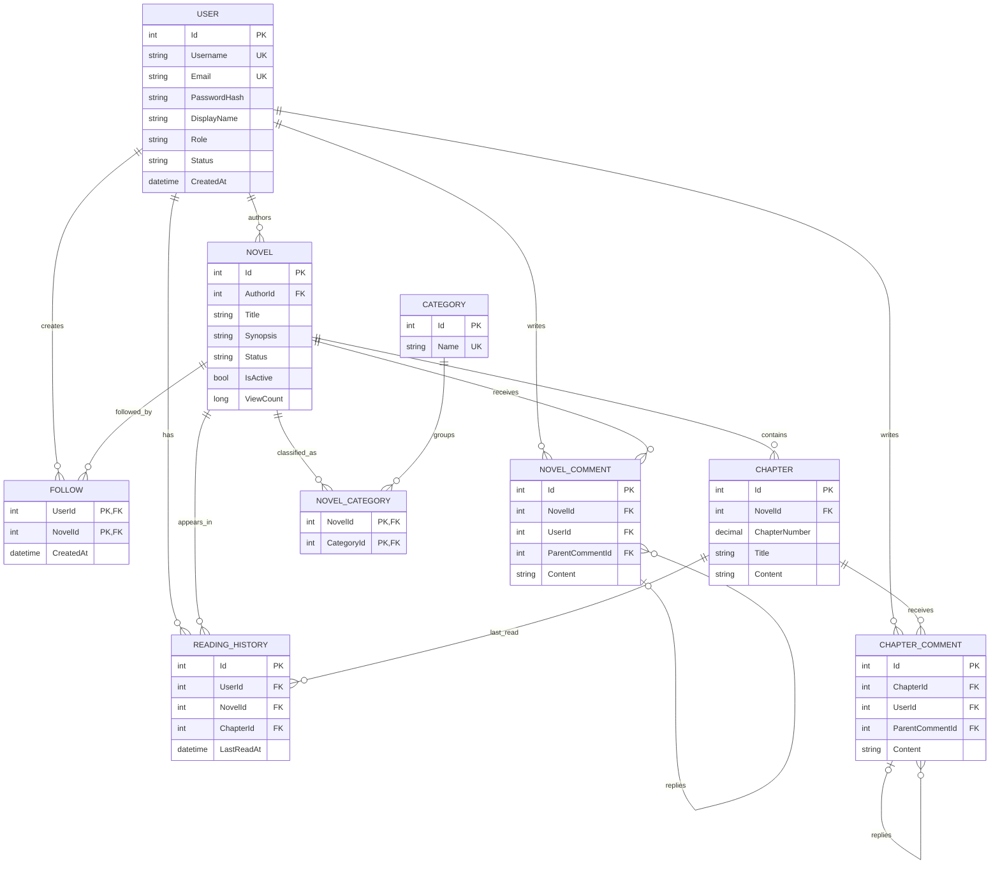

# Data Model

## 1. Entity Relationship Diagram

## 2. Quy tắc dữ liệu quan trọng

- `User.Username` và `User.Email` là duy nhất.
- Mỗi cặp `NovelId + ChapterNumber` là duy nhất.
- `NovelCategory` dùng khóa chính ghép `NovelId + CategoryId`.
- `Follow` dùng khóa chính ghép `UserId + NovelId`.
- Mỗi người dùng chỉ có một bản ghi lịch sử cho mỗi truyện.
- Xóa `Novel` sẽ cascade đến `Chapter`.
- `Novel.IsActive` và `User.Status = Inactive` được dùng cho xóa mềm.
- Comment hỗ trợ cấu trúc cha-con qua `ParentCommentId`.

