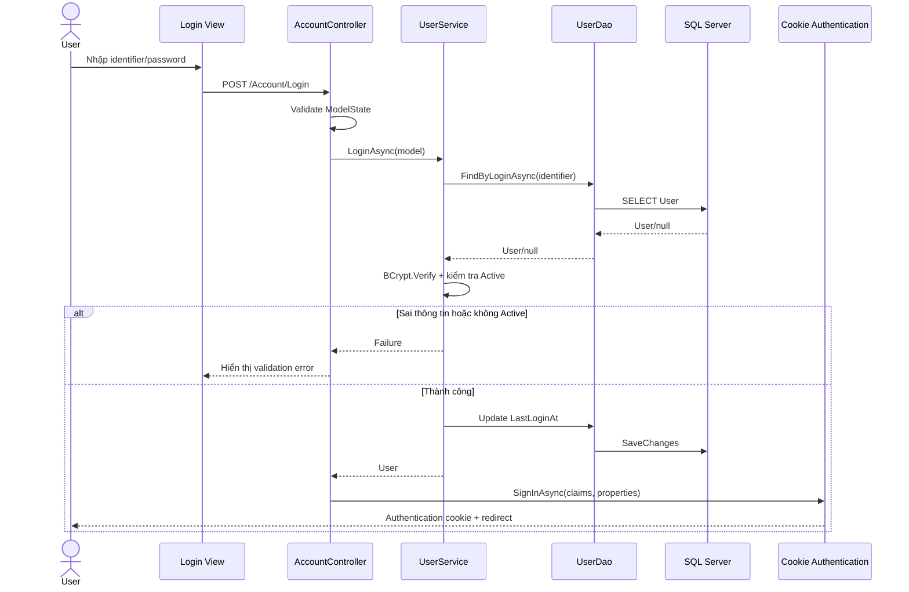
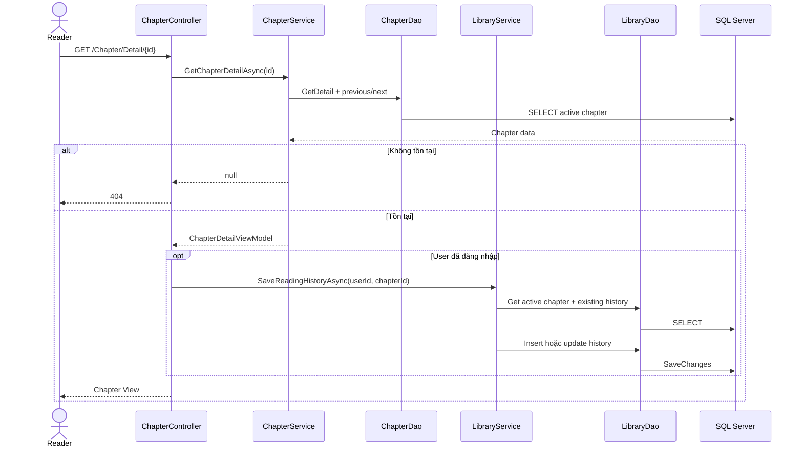
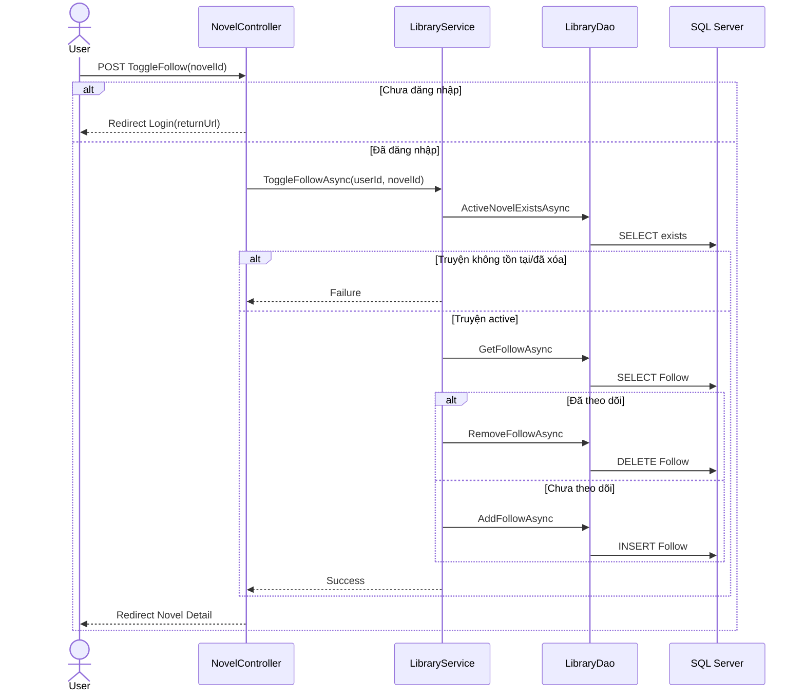
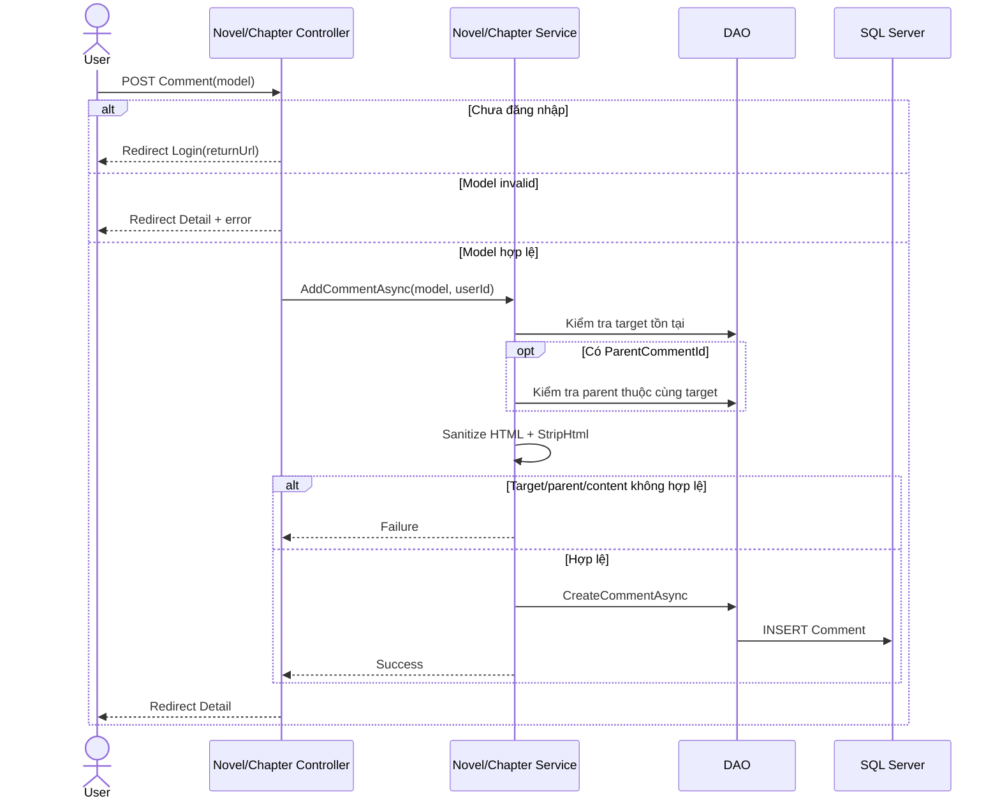
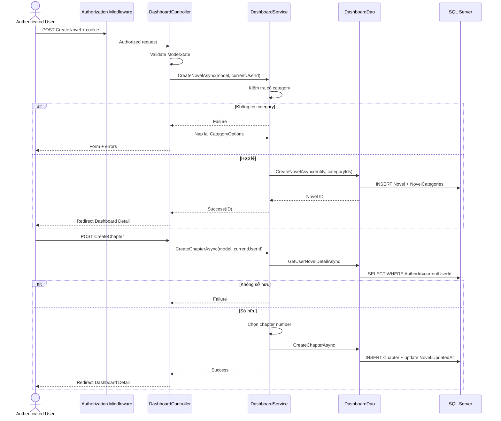
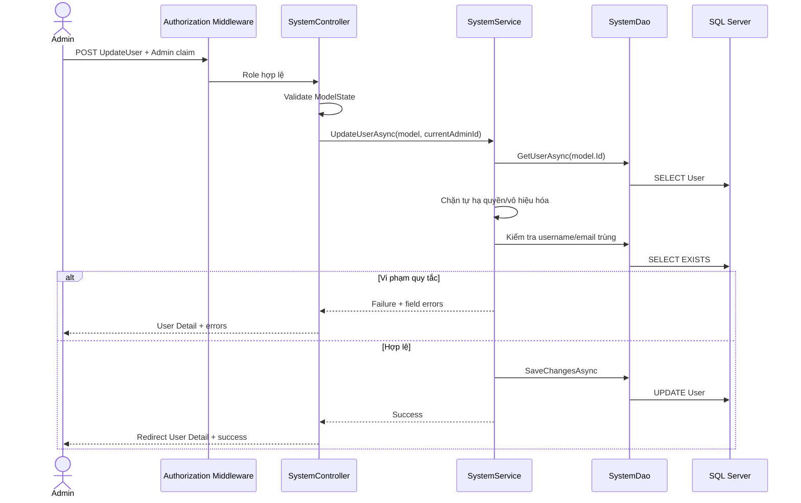

# Sequence Diagrams

## 1. Đăng nhập

```mermaid
sequenceDiagram
    actor U as User
    participant V as Login View
    participant C as AccountController
    participant S as UserService
    participant D as UserDao
    participant DB as SQL Server
    participant A as Cookie Authentication

    U->>V: Nhập identifier/password
    V->>C: POST /Account/Login
    C->>C: Validate ModelState
    C->>S: LoginAsync(model)
    S->>D: FindByLoginAsync(identifier)
    D->>DB: SELECT User
    DB-->>D: User/null
    D-->>S: User/null
    S->>S: BCrypt.Verify + kiểm tra Active
    alt Sai thông tin hoặc không Active
        S-->>C: Failure
        C-->>V: Hiển thị validation error
    else Thành công
        S->>D: Update LastLoginAt
        D->>DB: SaveChanges
        S-->>C: User
        C->>A: SignInAsync(claims, properties)
        A-->>U: Authentication cookie + redirect
    end
```

## 2. Xem chương và lưu lịch sử

```mermaid
sequenceDiagram
    actor U as Reader
    participant C as ChapterController
    participant CS as ChapterService
    participant CD as ChapterDao
    participant LS as LibraryService
    participant LD as LibraryDao
    participant DB as SQL Server

    U->>C: GET /Chapter/Detail/{id}
    C->>CS: GetChapterDetailAsync(id)
    CS->>CD: GetDetail + previous/next
    CD->>DB: SELECT active chapter
    DB-->>CS: Chapter data
    alt Không tồn tại
        CS-->>C: null
        C-->>U: 404
    else Tồn tại
        CS-->>C: ChapterDetailViewModel
        opt User đã đăng nhập
            C->>LS: SaveReadingHistoryAsync(userId, chapterId)
            LS->>LD: Get active chapter + existing history
            LD->>DB: SELECT
            LS->>LD: Insert hoặc update history
            LD->>DB: SaveChanges
        end
        C-->>U: Chapter View
    end
```

## 3. Theo dõi/bỏ theo dõi

```mermaid
sequenceDiagram
    actor U as User
    participant C as NovelController
    participant S as LibraryService
    participant D as LibraryDao
    participant DB as SQL Server

    U->>C: POST ToggleFollow(novelId)
    alt Chưa đăng nhập
        C-->>U: Redirect Login(returnUrl)
    else Đã đăng nhập
        C->>S: ToggleFollowAsync(userId, novelId)
        S->>D: ActiveNovelExistsAsync
        D->>DB: SELECT exists
        alt Truyện không tồn tại/đã xóa
            S-->>C: Failure
        else Truyện active
            S->>D: GetFollowAsync
            D->>DB: SELECT Follow
            alt Đã theo dõi
                S->>D: RemoveFollowAsync
                D->>DB: DELETE Follow
            else Chưa theo dõi
                S->>D: AddFollowAsync
                D->>DB: INSERT Follow
            end
            S-->>C: Success
        end
        C-->>U: Redirect Novel Detail
    end
```

## 4. Bình luận truyện/chương

```mermaid
sequenceDiagram
    actor U as User
    participant C as Novel/Chapter Controller
    participant S as Novel/Chapter Service
    participant D as DAO
    participant DB as SQL Server

    U->>C: POST Comment(model)
    alt Chưa đăng nhập
        C-->>U: Redirect Login(returnUrl)
    else Model invalid
        C-->>U: Redirect Detail + error
    else Model hợp lệ
        C->>S: AddCommentAsync(model, userId)
        S->>D: Kiểm tra target tồn tại
        opt Có ParentCommentId
            S->>D: Kiểm tra parent thuộc cùng target
        end
        S->>S: Sanitize HTML + StripHtml
        alt Target/parent/content không hợp lệ
            S-->>C: Failure
        else Hợp lệ
            S->>D: CreateCommentAsync
            D->>DB: INSERT Comment
            S-->>C: Success
        end
        C-->>U: Redirect Detail
    end
```

## 5. Tạo truyện và chương

```mermaid
sequenceDiagram
    actor U as Authenticated User
    participant M as Authorization Middleware
    participant C as DashboardController
    participant S as DashboardService
    participant D as DashboardDao
    participant DB as SQL Server

    U->>M: POST CreateNovel + cookie
    M->>C: Authorized request
    C->>C: Validate ModelState
    C->>S: CreateNovelAsync(model, currentUserId)
    S->>S: Kiểm tra có category
    alt Không có category
        S-->>C: Failure
        C->>S: Nạp lại CategoryOptions
        C-->>U: Form + errors
    else Hợp lệ
        S->>D: CreateNovelAsync(entity, categoryIds)
        D->>DB: INSERT Novel + NovelCategories
        D-->>S: Novel ID
        S-->>C: Success(ID)
        C-->>U: Redirect Dashboard Detail
    end

    U->>C: POST CreateChapter
    C->>S: CreateChapterAsync(model, currentUserId)
    S->>D: GetUserNovelDetailAsync
    D->>DB: SELECT WHERE AuthorId=currentUserId
    alt Không sở hữu
        S-->>C: Failure
    else Sở hữu
        S->>S: Chọn chapter number
        S->>D: CreateChapterAsync
        D->>DB: INSERT Chapter + update Novel.UpdatedAt
        S-->>C: Success
        C-->>U: Redirect Dashboard Detail
    end
```

## 6. Admin cập nhật người dùng

```mermaid
sequenceDiagram
    actor A as Admin
    participant M as Authorization Middleware
    participant C as SystemController
    participant S as SystemService
    participant D as SystemDao
    participant DB as SQL Server

    A->>M: POST UpdateUser + Admin claim
    M->>C: Role hợp lệ
    C->>C: Validate ModelState
    C->>S: UpdateUserAsync(model, currentAdminId)
    S->>D: GetUserAsync(model.Id)
    D->>DB: SELECT User
    S->>S: Chặn tự hạ quyền/vô hiệu hóa
    S->>D: Kiểm tra username/email trùng
    D->>DB: SELECT EXISTS
    alt Vi phạm quy tắc
        S-->>C: Failure + field errors
        C-->>A: User Detail + errors
    else Hợp lệ
        S->>D: SaveChangesAsync
        D->>DB: UPDATE User
        S-->>C: Success
        C-->>A: Redirect User Detail + success
    end
```

