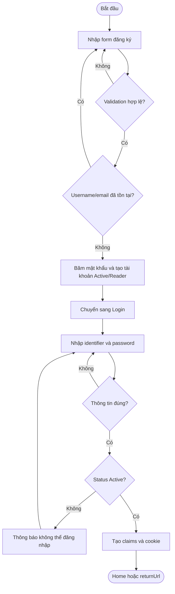
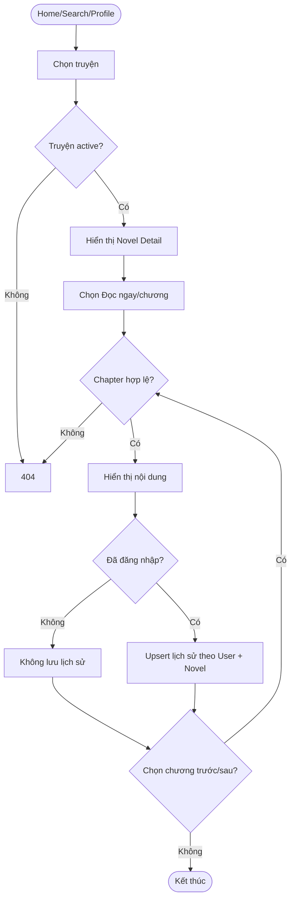
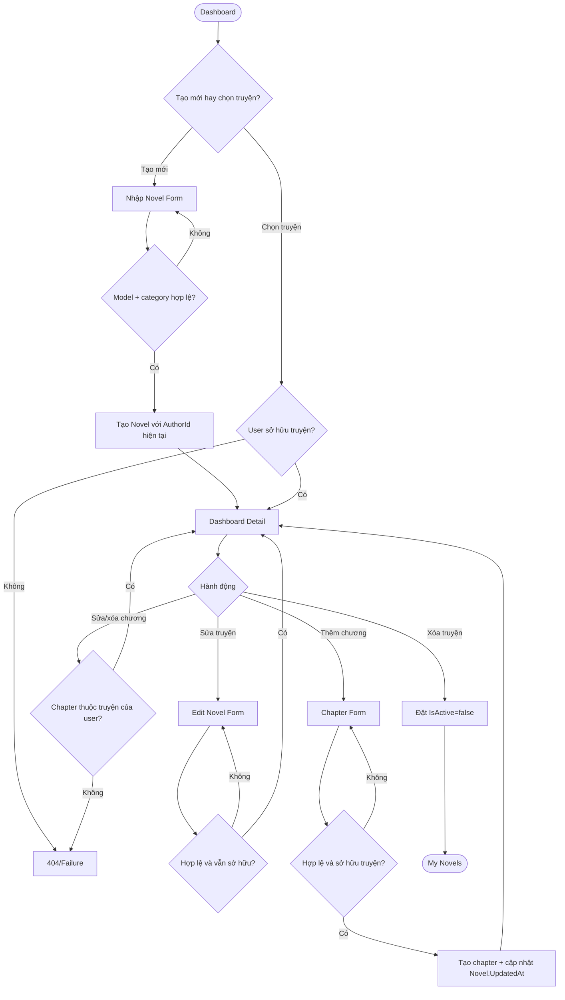
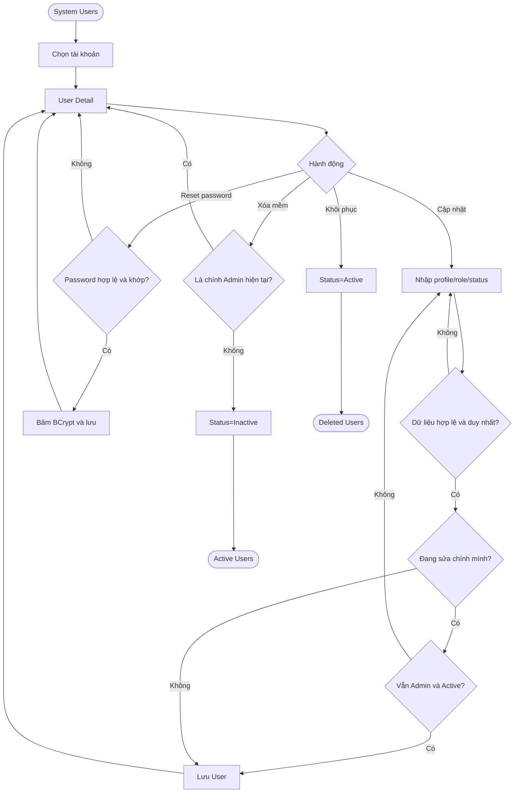
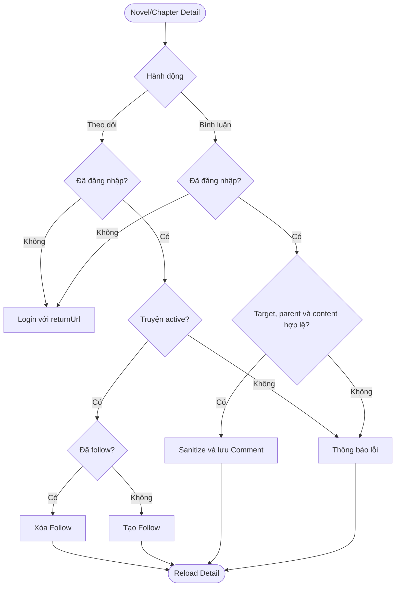

# Activity Diagrams

## 1. Đăng ký và đăng nhập

```mermaid
flowchart TD
    A([Bắt đầu]) --> B[Nhập form đăng ký]
    B --> C{Validation hợp lệ?}
    C -- Không --> B
    C -- Có --> D{Username/email đã tồn tại?}
    D -- Có --> B
    D -- Không --> E[Băm mật khẩu và tạo tài khoản Active/Reader]
    E --> F[Chuyển sang Login]
    F --> G[Nhập identifier và password]
    G --> H{Thông tin đúng?}
    H -- Không --> G
    H -- Có --> I{Status Active?}
    I -- Không --> J[Thông báo không thể đăng nhập]
    J --> G
    I -- Có --> K[Tạo claims và cookie]
    K --> L([Home hoặc returnUrl])
```

## 2. Đọc truyện

```mermaid
flowchart TD
    A([Home/Search/Profile]) --> B[Chọn truyện]
    B --> C{Truyện active?}
    C -- Không --> Z[404]
    C -- Có --> D[Hiển thị Novel Detail]
    D --> E[Chọn Đọc ngay/chương]
    E --> F{Chapter hợp lệ?}
    F -- Không --> Z
    F -- Có --> G[Hiển thị nội dung]
    G --> H{Đã đăng nhập?}
    H -- Không --> I[Không lưu lịch sử]
    H -- Có --> J[Upsert lịch sử theo User + Novel]
    I --> K{Chọn chương trước/sau?}
    J --> K
    K -- Có --> F
    K -- Không --> L([Kết thúc])
```

## 3. Quản lý tác phẩm

```mermaid
flowchart TD
    A([Dashboard]) --> B{Tạo mới hay chọn truyện?}
    B -- Tạo mới --> C[Nhập Novel Form]
    C --> D{Model + category hợp lệ?}
    D -- Không --> C
    D -- Có --> E[Tạo Novel với AuthorId hiện tại]
    E --> F[Dashboard Detail]
    B -- Chọn truyện --> G{User sở hữu truyện?}
    G -- Không --> H[404/Failure]
    G -- Có --> F
    F --> I{Hành động}
    I -- Sửa truyện --> J[Edit Novel Form]
    J --> K{Hợp lệ và vẫn sở hữu?}
    K -- Không --> J
    K -- Có --> F
    I -- Thêm chương --> L[Chapter Form]
    L --> M{Hợp lệ và sở hữu truyện?}
    M -- Không --> L
    M -- Có --> N[Tạo chapter + cập nhật Novel.UpdatedAt]
    N --> F
    I -- Sửa/xóa chương --> O{Chapter thuộc truyện của user?}
    O -- Không --> H
    O -- Có --> F
    I -- Xóa truyện --> P[Đặt IsActive=false]
    P --> Q([My Novels])
```

## 4. Admin quản lý tài khoản

```mermaid
flowchart TD
    A([System Users]) --> B[Chọn tài khoản]
    B --> C[User Detail]
    C --> D{Hành động}
    D -- Cập nhật --> E[Nhập profile/role/status]
    E --> F{Dữ liệu hợp lệ và duy nhất?}
    F -- Không --> E
    F -- Có --> G{Đang sửa chính mình?}
    G -- Có --> H{Vẫn Admin và Active?}
    H -- Không --> E
    H -- Có --> I[Lưu User]
    G -- Không --> I
    D -- Reset password --> J{Password hợp lệ và khớp?}
    J -- Không --> C
    J -- Có --> K[Băm BCrypt và lưu]
    D -- Xóa mềm --> L{Là chính Admin hiện tại?}
    L -- Có --> C
    L -- Không --> M[Status=Inactive]
    D -- Khôi phục --> N[Status=Active]
    I --> C
    K --> C
    M --> O([Active Users])
    N --> P([Deleted Users])
```

## 5. Theo dõi và bình luận

```mermaid
flowchart TD
    A([Novel/Chapter Detail]) --> B{Hành động}
    B -- Theo dõi --> C{Đã đăng nhập?}
    C -- Không --> D[Login với returnUrl]
    C -- Có --> E{Truyện active?}
    E -- Không --> F[Thông báo lỗi]
    E -- Có --> G{Đã follow?}
    G -- Có --> H[Xóa Follow]
    G -- Không --> I[Tạo Follow]
    B -- Bình luận --> J{Đã đăng nhập?}
    J -- Không --> D
    J -- Có --> K{Target, parent và content hợp lệ?}
    K -- Không --> F
    K -- Có --> L[Sanitize và lưu Comment]
    H --> M([Reload Detail])
    I --> M
    L --> M
    F --> M
```

