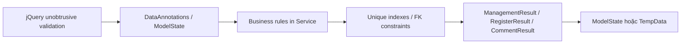

# Validation and Error Handling

## 1. Validation theo form

| Form/ViewModel | Field | Quy tắc |
|---|---|---|
| Register | Username | Bắt buộc, 3–50, regex `[a-zA-Z0-9._]+`, duy nhất |
| Register | Email | Bắt buộc, email hợp lệ, tối đa 256, duy nhất |
| Register | DisplayName | Bắt buộc, 2–100 |
| Register | Password | Bắt buộc, 8–100 |
| Register | ConfirmPassword | Bắt buộc, khớp Password |
| Register | AcceptTerms | Phải được chọn |
| Login | Identifier | Bắt buộc, tối đa 256 |
| Login | Password | Bắt buộc |
| Profile Edit | Id | Bắt buộc và phải bằng current user ID |
| Profile Edit | DisplayName | Bắt buộc, 2–100 |
| Profile Edit | Bio | Tối đa 500 |
| Profile Edit | AvatarUrl | Tối đa 500, URL hợp lệ |
| Change Password | NewPassword | Bắt buộc, 6–100 |
| Change Password | ConfirmPassword | Bắt buộc, khớp NewPassword |
| Novel Form | Title | Bắt buộc, tối đa 250 |
| Novel Form | OtherNames/CoverImage | Tối đa 500; cover phải là URL |
| Novel Form | OriginalAuthor/Illustrator/TranslationGroup | Tối đa 150 |
| Novel Form | StoryType | Bắt buộc, tối đa 50 |
| Novel Form | Synopsis | Bắt buộc |
| Novel Form | CategoryIds | Ít nhất một category ở service |
| Chapter Form | NovelId | Bắt buộc |
| Chapter Form | ChapterNumber | Nếu `<= 0`, tự sinh; unique theo Novel |
| Chapter Form | Title | Bắt buộc, tối đa 250 |
| Chapter Form | Content | Bắt buộc |
| Comment | Target ID | Bắt buộc, target phải tồn tại và active |
| Comment | ParentCommentId | Nếu có, phải thuộc cùng target |
| Comment | Content | Bắt buộc, tối đa 3000, không được chỉ chứa HTML rỗng |
| Admin User Edit | Username/Email | Quy tắc như tài khoản và duy nhất với user khác |
| Admin User Edit | DisplayName | Bắt buộc, 2–100 |
| Admin User Edit | Bio/AvatarUrl | Tối đa 500; avatar là URL |
| Admin Reset Password | NewPassword | Bắt buộc, 6–100 |
| Admin Reset Password | ConfirmPassword | Bắt buộc, khớp |

## 2. Các lớp validation

| Lớp | Ví dụ | Mục đích |
|---|---|---|
| Client | Required, StringLength | Phản hồi nhanh; không phải lớp bảo mật |
| Controller | `ModelState.IsValid` | Chặn input không hợp lệ trước service |
| Service | ownership, active status, unique lookup | Bảo vệ quy tắc nghiệp vụ |
| DAO query | `AuthorId == userId`, `IsActive` | Giới hạn tài nguyên ngay tại truy vấn |
| Database | unique index, foreign key | Bảo vệ tính toàn vẹn cuối cùng |

## 3. Ma trận xử lý lỗi HTTP/UI

| Tình huống | Xử lý hiện tại | Kết quả UI |
|---|---|---|
| Chưa login vào `[Authorize]` | Cookie middleware | Redirect `/Account/Login` |
| Không phải Admin vào System | AccessDeniedPath | Redirect `/Account/Login` |
| Novel/Chapter/Profile không tồn tại | Controller `NotFound()` | Status code page chạy lại 404 |
| Dashboard resource không sở hữu | Service/DAO trả null/failure | 404 hoặc error message tùy action |
| Form validation lỗi | Trả lại View | Hiển thị `ModelState` |
| Nghiệp vụ lỗi tại form | Add `ModelState` errors | Giữ form và hiển thị lỗi |
| POST thành công | TempData + Redirect | Success message, tránh submit lặp |
| Follow/comment lỗi | TempData + Redirect Detail | Thông báo tại màn chi tiết |
| Xóa/khôi phục lỗi | TempData + Redirect list | Error message tại danh sách |
| Exception production | ExceptionHandler | `/Home/Error` |
| Status code 404 | StatusCodePagesWithReExecute | `/Home/NotFoundPage` |

## 4. Quy tắc bảo mật form

- Mọi POST hiện có dùng `[ValidateAntiForgeryToken]`.
- Không tin ID/role từ client; current user ID phải lấy từ claim.
- `AuthorId` của Novel phải gán ở server.
- Password không được log hoặc trả lại View.
- Nội dung comment HTML phải sanitize ở server.
- URL ảnh/avatar cần validation và nên có allowlist/proxy nếu triển khai production.

## 5. Các cải tiến nên thực hiện

| Ưu tiên | Cải tiến |
|---|---|
| Cao | Tạo trang `/Account/AccessDenied` riêng và trả 403 đúng nghĩa |
| Cao | Làm mới/thu hồi cookie khi role hoặc status thay đổi |
| Cao | Bắt `DbUpdateException` cho trùng chapter number và hiển thị lỗi field |
| Cao | Dùng thư viện HTML sanitizer chuẩn thay cho sanitize bằng xử lý chuỗi |
| Trung bình | Thêm rate limiting cho Login và Comment |
| Trung bình | Thêm pagination và giới hạn query |
| Trung bình | Thêm logging có cấu trúc cho hành động Admin |
| Trung bình | Thêm confirmation rõ ràng cho hành động destructive |
| Thấp | Chuẩn hóa password minimum giữa đăng ký (8) và đổi/reset (6) |

